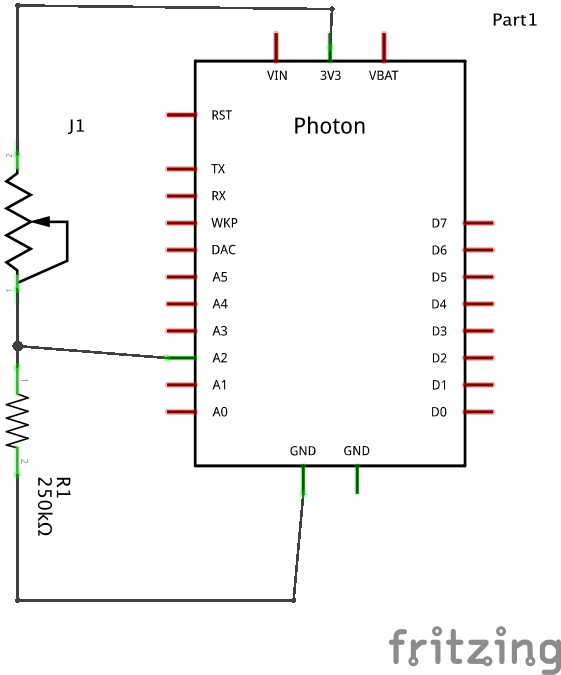

# Flex Sensor and Square Force Resistor

The Flex sensor detects a certain amount of bend in the sensor. The Square Force Resistor detects the amount of force being applied to sensor area. Both of these sensors are _variable resistors_. They do not have microcontrollers or libraries and must be wired into additional circuitry to work.

### Variable Resistance

Try testing the amount of resistance in the resistor by using a multimeter, set to read resistance in Ohms. Notice that as you bend the flex sensor or apply force to the square force resistor, the resistance changes. This impedes the flow of electricity through the resistor, and some of the current is converted to heat energy. This means that we can use it to create a type of circuit called a "voltage divider."



### Voltage Divider

The `J1` resistor in the diagram is your flex sensor or square force resistor. The other resistor is a 250 kiloOhm resistor. In this circuit, when the variable resistance increases, the voltage level going to the `A2` port decreases. Try wiring this circuit and using this code:

```
#define RESISTOR A2

int voltage = 0;

void setup() {
  pinMode(RESISTOR, INPUT);
  Particle.variable("voltage", voltage); 
}

void loop() {
  voltage = analogRead(RESISTOR);
}
```

### Resistor Values

Picking the corrent resistance value for the second resistor (labeled R2) can be tricky. It depends on what kind of _response curve_ you are looking for. In electrical engineering, we can model the behavior of the voltage divider using an equation. 


To see an interactive version of this equation where you can try picking different R2 values to see the response curve, use this graphing calculator:

[Voltage Divider Graph](https://www.desmos.com/calculator/yjtzvg3bhv)

### Try This

- Publish an event when the flex sensor or square force resistor changes the voltage past a certain value