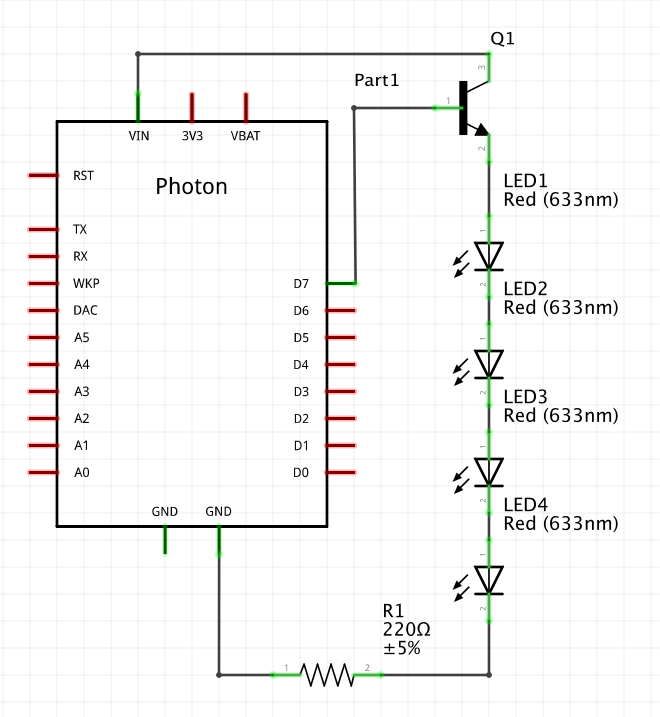

# Development Boards and GPIO Pins

### Introduction

Development boards are programmable microcontrollers that are designed to conveniently connect to a variety sensors and output devices. When your wearable device goes into production, an engineer will take all of the components and the development board processor and create a single integrated device.

### Particle.io Photon

We're using the Particle.io Photon as our development board. It works almost exactly the same as the SparkFun Photon Redboard you used in the Robotics unit. However, we have to find a way to provide power in a convenient format that makes the device wearable.

### Light an LED

Let's try flashing your Photon with a basic program.

```
void setup() {
  pinMode(7, OUTPUT);
}

void loop() {
  digitalWrite(7, HIGH);
  delay(1000);
  digitalWrite(7, LOW);
  delay(1000);
}
```

### GPIO Pins

Your Photon has pins labeled D0 through D7 on one side, and A0 through A5 on the other. These are General Purpose Input Output pins. They can be used to either output an electrical signal or receive an electrical signal as input. The D0 - D7 pins are called _digital_ pins. They can be either _HIGH_ or _LOW_. The A0 - A5 pins are analog pins, and can vary from a value of 0 to 1024. On many devices, at least one pin is also tied to an LED.

### Firmware Functions

`pinMode(7, OUTPUT)` sets the D7 pin to output mode. That is, it can output a HIGH value or LOW value. To actually output the value, you can use the `digitalWrite` function.

### Try This

- Create your own repeating blink pattern on the D7 LED
- Set a multimeter to read DC Voltage (DCV) at 20 volts. Test your device with the red (positive) lead on the D7 pin and the black (negative) lead on the GND pin. How much voltage do you read?
- Try setting one of the analog pins to output  with `pinMode(A1, OUTPUT);` and writing an analog value to that pin with `analogWrite(A1, 800);`. Read the voltage between the analog pin you choose and the GND pin. What do you see?
- Try using connecting one of the LilyPad LEDs to D0 and GND. The LED + (anode) pin connects to D0 and the LED - (cathode) pin connect to GND. Try writing an analog value between 0 and 255 to this pin. What happens?
- Try writing a cloud function to turn and off the D7 onboard LED.

### Nuts and Bolts

TL;DR - The Photon operates on 3.3v logic, meaning a digital HIGH voltage will be 3.3v. GPIO pins can also do Pulse Width Modulation (PWM) and have a maximum current load.

_Digital GPIO Pins_

The digital GPIO pins will output 3.3 volts when set to HIGH and 0v when set to LOW. In actuality, when the output is set to LOW on any pin, the device ties that pin to GND. It's not a safe way of getting an extra ground for a high amount of voltage from something like a motor, but it's useful for doing something like operating an external device. For example, if we wanted the Photon to shut off the PowerBoost, we could tie the PowerBoost's EN to a GPIO pin on the Photon, set it to HIGH, and then toggle it to LOW when you wanted to tie the EN pin to GND.

_Pulse Width Modulation_

To get an LED to "dim", it's possible to do an `analogWrite` between 0 and 255 to any pin from D0-D3 or A4-A7. This will operate the pin as Pulse Width Modulation (PWM). PWM "pulses" or flickers the current. At 128, it will output a HIGH current approximately 50% ( 128 / 255 * 100 ) of the time. This causes the LED to partially charge and have a dim glow. Many devices operate using PWM.

There's a common misconception that the LED itself is flickering more rapidly than the human eye can see. The LED is actually partially charging and discharging. If you were to slow down the frequency of the PWM, then it might actually be slow enough to allow the LED to fully charge and discharge, at which point you would see an actual flicker. However, the default frequency on the Photon is 500 Hz.

_Maximum Load_

GPIO pins aren't capable of putting out a lot of power. Voltage represents the potential or "desire" for electricity to flow. However, the actual amount of current flowing through a connection is measured with _amperes_, which is a measurement of the rate of electrons flowing through the connection. Power is measured in _watts_, which is voltage multipled by amperage. You can check for tolerances of the Photon by looking at its [datasheet](https://docs.particle.io/datasheets/photon-datasheet/). The important specs are as follows:

- The VIN pin can output 1 amp
- The 3V3 pin can only supply 100 milliamps
- Each digital and analog GPIO pin can only supply 25 milliamps (enough to light up one LED or other device, at most)
- The PowerBoost 500C can output a total of 500 milliamps of power from its 5v pin

_So How Do I Control A Chain of LEDs?_

Let's say you have five LEDs daisy chained to one GPIO pin. It won't light up, or it will be very dim. That's because the maximum current draw is too high for a GPIO pin. Instead, you'll have to use a _transistor_. A transistor is effectively a voltage controlled gateway.



In this schematic, the transistor controls current flow from the VIN pin to the chain of LEDs and the resistor. When the D7 pin outputs a HIGH signal to the transistor, current can flow. When D7 is LOW, no current can flow.