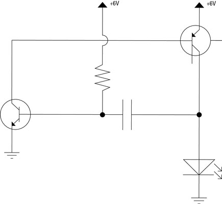

# Output Devices

Output devices are anything that provides feedback to the wearer of your device. There are three output devices that you will use:

- LilyPad Sewable LED
- LilyPad Vibe Board
- LilyPad Buzzer

### Symbols

These are the symbols for LEDs, Motors (which the vibe board is) and Buzzers.

Notice the LED is shaped like an arrow. The end at the top is the anode (+) end. Electricity can only flow from this direction. The other end is the cathode (-) end. It must lead to ground. The other devices can technically be connected either way.

### Connections

The Sewable LED, Vibe Board and Buzzer can all operate as analog devices. The anode (+) pin can connect to pins D0-D3 or A4 or A5, since these pins are capable of performing Pulse Width Modulation. The cathode (-) pin must connect to ground. 

### Common Ground

Since there are many devices that must connect to ground, you can connect a single ground from the dev board to a row on the breadboard, and connect every device that leads to ground to that row. This is called a _common ground_. Here's the schematic:

Notice the three lines that get smaller and look like a triangle at the bottom of the left and right side of the diagram. Common grounds are so frequently used that electrical engineers draw using this symbol and don't bother showing the actual ground connection.

### Try This:

- Connect the output devices using this schematic:

- Set the pin modes of each of the output device pins to OUTPUT
- Try controlling the LED with [`analogWrite`](https://docs.particle.io/reference/firmware/photon/#analogwrite-pwm-)
- Try controlling the Vibe motor with [`analogWrite`](https://docs.particle.io/reference/firmware/photon/#analogwrite-pwm-)
- Try controlling the Buzzer with [`tone`](https://docs.particle.io/reference/firmware/photon/#tone-)

### Adafruit NeoPixel

The Adafruit NeoPixel is an addressable LED. You can string many of them to each other on the same channel and control each individually. Additionally, each one can be any combination of red, green and blue light. Effectively, millions of these are what make up a [Jumbotron](http://s3.amazonaws.com/media.wbur.org/wordpress/10/files/2015/11/1128_oag-jumbotron.jpg).

To connect them, you can refer to this diagram:

The device connected to the `VIN` pin on the Photon is a resistor, a device that converts some of the current on the circuit to heat and shields the pixels. The first pixel's `IN` pin must be connected to the Photon's `D2`. The `OUT` pin of the first pixel connects to the `IN` pin of the next pixel, and many pixels can be daisy chained.

To program the pixel, search for the `NEOPIXEL` library in the Build IDE. You can use the example code, but you must set the `PIXEL_COUNT` to match the number of pixels you have wired.
