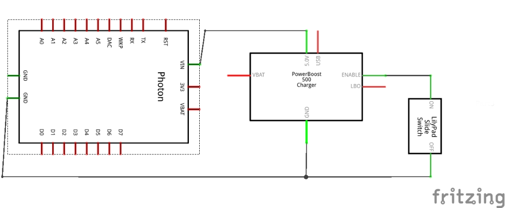
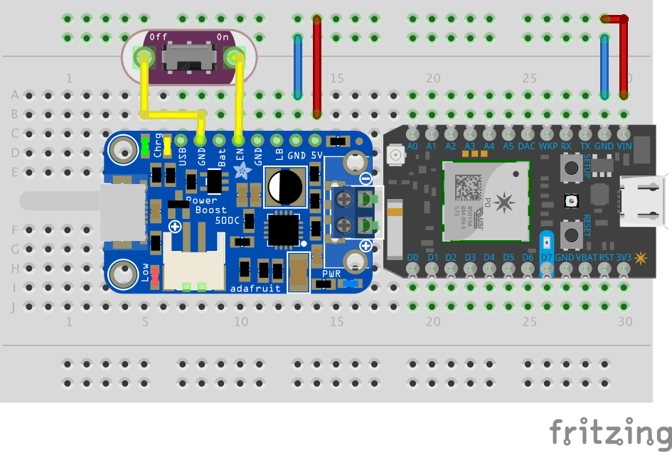

# Schematics

### Introduction

We will be connecting the Particle Photon, Adafruit PowerBoost 500C and LilyPad Slide Switch to create our first device mock-up.

|Component|Purpose|
|---------|-------|
|Particle Photon|Our programmable logic board, which is almost identical in function to the SparkFun Photon Redboard that we used for Robotics|
|PowerBoost 500C|A battery charger and power regulator that will distribute power to our device|
|LilyPad Slide Switch|A switch that we will use to turn the PowerBoost 500C on and off|

### Schematics

This is an electrical engineering schematic of how to connect a PowerBoost 500C, Photon and LilyPad slide switch to create a basic device that can be turned on and off. It is a diagram that shows the electrical connections between components. It is a symbolic diagram, rather than a physical diagram, so the object may look different when constructed. For example, if we were to use a breadboard to construct this device, it may look like this:

As you can see, some of the components may even have a different number of physical _pins_ than the schematic. Typically, this is because there may be many ground pins (GND) on the actual board, but all grounds tend to lead to the same place, therefore it's only necessary to show one GND pin on the schematic.

### Pins

Each of the small copper circles is called a "pin". Specifically, it's a 0.1" through-hole pin. It doesn't look like a pin, but that's because we typically solder a copper pin through them to create a connection. For building our wearable, you can solder pins and use a breadboard (and remove them later), use alligator clips, or sew conductive thread through the holes to create connections.

### Sewable Electronics

The interesting thing about sewable electronics is that the conductive threads that make up the wiring traces will closely match the schematic. It's often easier to translate schematics to sewables than it is to translate them to breadboard prototypes. The only thing major difference is that conductive thread traces _*CANNOT TOUCH EACH OTHER*_.

### Try This

- Use alligator clips to make these connections and build this device. 
- Try turning your device on and off using the slide switch to see what happens.
- Use a multimeter, set to 200 Ohm resistance, to test various connections. What happens when you try touching two different GND pins together? 

### Nuts and Bolts

TL;DR - The "on" and "off" labels on the switch are misleading. They simply open and close the connection between the EN and GND pins on the PowerBoost 500C.

_Open and Close vs. On and Off_

It's user friendly to say "on" and "off" on a switch, but in reality the switch is "closed" in the "on" position, meaning a connection between both poles has been made and electricity can flow through the switch. In the "off" position, the switch is "open" and no electricity can flow between the poles of the switch. In the case of the PowerBoost 500C, "tying enable to ground" deactivates the device. This means that if there is a closed connection between the EN and GND pin, the device powers off. Therefore, "on" on the LilyPad Slide Switch actually turns off the device.

_Multimeter Testing_

The easiest way to see if there is a connection between two pins is to set a multimeter to measure resistance. On a digital multimeter, you may see the display read "1" on the far left of the readout. This means that there is more resistance than the multimeter can currently measure. If you touch the two test prongs of the multimeter together, the resistance will drop. This means that low resistance shows that electricity can flow between two points. If you touch any two GND pins on the Photon, you will notice resistance drops. That's because all of the grounds on the Photon are said to be "tied together." In fact, on most devices, all grounds on all devices are tied together. The ground completes the electrical circuit and voltage follows back to the battery.