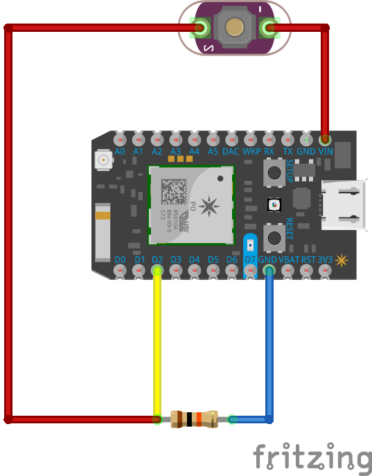

# Switches

Your GPIO pins are able to read a change in a voltage. This can mean that current can rise or fall, and the GPIO pin can detect it. Create the following circuit:



Flash this code:

```
#define	BUTTON		2
#define	LED			7
volatile boolean signal = false;

void rising() {
  signal = true;
}

void setup() {
  pinMode(LED, OUTPUT);
  pinMode(BUTTON, INPUT);
  attachInterrupt(BUTTON, rising, RISING);
}

void loop() {
  digitalWrite(LED, signal);
}
```

Try it out. What kind of behavior do you notice?

### How it Works

The function `rising` is an _interrupt service routine_ or _ISR_. It's a function that is automatically called and _interrupts_ the loop if something happens. In the setup method, notice that we set pin 2 to `INPUT`, and immediately after that we have a line of code that looks like this:

```
attachInterrupt(2, rising, RISING);
```

This attaches our ISR to trigger whenever the voltage value on pin `2` is `RISING`. When that happens, the variable `signal` gets flipped from `false` to `true`, or vice versa. When the ISR finishes, `loop` continues and writes whatever the current signal value is to pin `7`.

### But It Sometimes Gets Stuck.

If you say that the button sometimes gets "stuck", that's correct. A spring loaded tactile pushbutton tends to bounce a lot, sending multiple signals. Let's fix it. Replace your code with this:

```
#define BUTTON  2
#define LED     7

// Stores whether or not a signal changed on our input pin
volatile boolean signal = false;

// Stores whether or not the LED should be on or off
boolean state = false;

// Stores the time that the last button push happened
long lastPush = 0;

void falling() {
  // When a falling signal happens, set signal so the loop knows
  // that the button was pushed
  signal = true;
}

void setup() {
  pinMode(LED, OUTPUT);
  pinMode(BUTTON, INPUT);
  
  // Attach the falling function as an ISR when the voltage falls
  attachInterrupt(BUTTON, falling, FALLING);
}

void loop() {
  // if the button was push and the difference between the current time and 
  // the last time the button was pushed is greater than 500...
  if (signal && millis() - lastPush > 500) {
    // flip the LED state variable
    state = !state;
    // write the current state to the LED
    digitalWrite(LED, state);
    // save the current time
    lastPush = millis();
    // clear the signal flag
    signal = false;
  }
}
```

That's very different. We've changed a lot of the logic. In general, we are now using a common technique called _debouncing_. Instead of letting the ISR set the button state directly, we are just having it signal the `loop` function that a falling signal happened. In the `loop`, if a falling signal happened and the time since the last falling signal is greater than 500 milliseconds, then we _toggle_ the LED.


### Try This

We can now detect a button push. Try getting your device to play tune on the buzzer when the button is pushed.